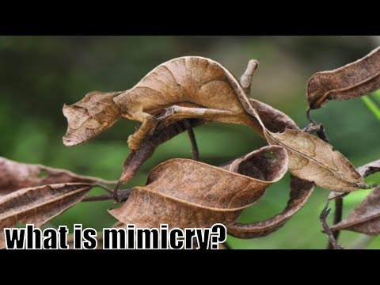

# Mimic 
In this assignment, you will use your knowledge of file reading, looping, and list and dictionary manipulation to map the words from the entire Alice's Adventures in Wonderland story and produce a cryptic, jumbled version of your own.

# Objectives
- Use python dictionaries and lists
- Use the `random` library
- Learn about reading text from a file
- More practice with looping

## Testing
This assignment has built-in tests to help you during development. Make sure all tests are passing before you submit your solution. You can invoke the tests from the command line:
```console
$ python -m unittest discover tests
```
You can also run these same tests using the `Test Explorer` extension built in to the VSCode editor, by enabling automatic test discovery.  This is a really useful tool and we highly recommend to learn it.

https://code.visualstudio.com/docs/python/testing#_test-discovery

- Test framework is `unittest`
- Test folder pattern is `test*`
- Test name pattern is `test*`


## Part A
Build a "mimic" dict that maps each word that appears in the [alice.txt](./alice.txt) file to a list of all the words that immediately follow that word in the file. The list of words can be in any order and should include duplicates. For example, the key `"and"` might have the list `["then", "best", "then", "after", ...]` listing all the words which came after "and" in the entire text.  Don't worry about any punctuation that is attached to words-- leave it there.

For development, use the short [imdev.txt](./imdev.txt) file. When your mimic dictionary is created from this file, it should look like this when printed:
```
{
    '' : ['I']
    'a' : ['software']
    'and' : ['I']
    'developer,' : ['and']
    'don't' : ['care']
    'I' : ['am', "don't"]
    'who' : ['knows"']
    'am' : ['a']
    'care' : ['who']
    'software' : ['developer,']
}
```
Notice that the first entry in the dictionary above is the empty string `""`.  Since we are creating a dictionary of "next word" lists, it implies that there exists a previous word key for each next-list value.  This, of course, is true except in the case of the first entry of the dictionary. Use the empty string as a seed for the first entry.

## Part B
Output your own jumbled version of the story!  With the mimic dict created, it's fairly easy to emit random text that mimics the original.

Complete the `print_mimic_random()` function in the mimic.py module. Print a word, then look up what words might come next and pick one at random as the next word. See the comments in the code for more detail on how to implement this.  The output words should be printed with a space ' ' delimiter between each word.  There should not be any newline \n characters in the printed output.

## Sample Output, using alice.txt as input, printing 200 words:
```console
Alice's shoulder, and seemed to the same order,' continued the hall; but, 
after glaring at all the Mock Turtle: `crumbs would be a good opportunity 
of authority over the Mouse. `--I proceed. "Edwin and she came a child!' 
said the Gryphon: and all round it, and sharks are all over the King replied. 
`Yes, please do!' said nothing. `When I'M a whisper, half no right distance--
but then Alice, and it. She went on, three weeks!' `I'm glad there seemed to
sing this:-- `Fury said Alice, and she had to see Shakespeare, in her hands
at the Gryphon, and, last word with a minute or other; but he had gone down
off staring at the Cat, she began: `O Mouse, do next! If they lessen from 
being drowned in the Panther received knife and turns out again. In the words
did not to say "What a Caterpillar called him as she was to the court, `Bring
me see--how IS the roof of delight, which the King said, just explain the
first one for two guinea-pigs, who only yesterday things are you?' She was gone,
and there was in a few minutes, and tumbled head first, and look at the words
```

For fun, try feeding your program to itself as input. 
    
```
$ python mimic.py mimic.py
```

## Going Further
How might you implement this same code using a Python [defaultdict](https://docs.python.org/3/library/collections.html#defaultdict-objects)?